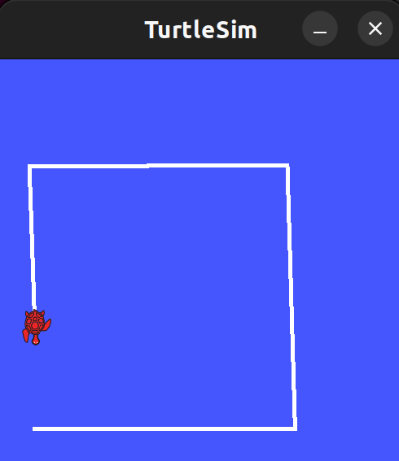
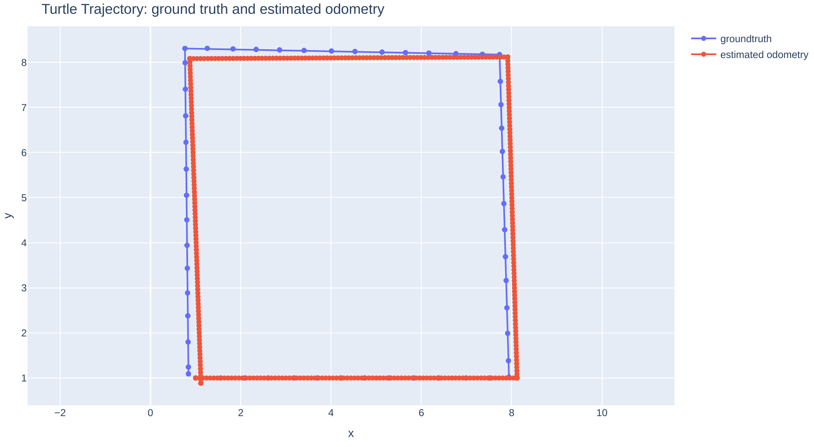
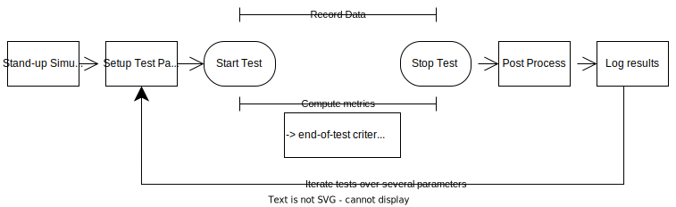

# demo-ros1-turtlesim
## Overview: a Development Environment for Demontrating the Artefact Platform with ROS 1.

For maximum simplicity, this demo uses the turtlesim simulator.


To demonstrate a foundational robotics use case, this demo implements the computation of the trajectory of the turtle, similar to any robot's odometry.



Artefact strives to enable managing and automating the entire lifecycle of robot feature development. The following lifecycle features are implemented in this demo:



After a one-time investment into setting up appropriate configurations (the artefact client and one .yaml config file), the functions in this diagram are all automated by artefact and launched with a single command by the user:
- **Stand-up simulation:** the turtlesim simulator is launched
- **Setup Test Params:** User-specified test-specific test parameters are reflected in the simulator, e.g. the turtle is teleported to the starting position
- **Start Test**: User-specified test commands are executed
- **Record Data**: During the test, data e.g. published ROS topics are recorded in a ROSbag.
- **Compute metrics**: During the test, additional nodes to compute metrics are executed
- **Stop Test**: User-specified test stop criteria or timeout defines the end of the tests and processes exit gracefully
- **Post Process**: User-specified post-processing script runs. Currently, its input is the ROSbag of recorded data. The output can be any file (e.g an html figure)
- **Log Results**: All artifacts created during the test are uploaded to the cloud and displayed in a Dashboard. E.g the ROSbag can be conveniently downloaded for future analysis / html figures are rendered. A share-able link can be used to invite collaborators to view test results.
- **Iterate tests over several parameters**: Parameters in the .yaml config file can be specified as a list of possible values. Then all of the above process will run for each combination of the parameters (grid search). All the data from each test will be automatically viewable in the cloud Dashboard.

For more insight into how artefact simplifies manual robotics development tasks see ["Approach to Robotics Testing, a Comparison"](README_comparison.md)


## Install and First Steps
1. Clone this repo and the artefact client repo side by side on your PC
```
git clone git@github.com:art-e-fact/demo-ros1-turtlesim.git
git clone git@github.com:art-e-fact/warp-client.git
mkdir ~/.artefacts
```
2. Build and run the docker container with this demo setup: this includes ROS1 dependencies, the setup of a ROS workspace with the turtle_odometry package sourced, as well as proper mounting of volumes to make development easier and aliases.
```
cd demo-ros1-turtlesim
docker-compose build
docker-compose run --rm turtle
```
Now you are within the docker container, where all development can happen (ROS commands / jupyter notebook server / all the code in the ros_workspace/src folder is synced with your host so you can use your desktop IDE).

3. Now setup the Artefact client (here, done in development mode):
```
cd /warp-client && pip install -e . && cd
```
(or use the convenience alias: `ww`)

Then, create an account at `https://app.artefacts.com` and perform just Step 2 of the instructions: adding a config with your API key (every command is always executed within the docker container).

Finally, go to the folder containing our artefacts.yaml config file and edit the the field `project` to match the name you chose in the Dashboard earlier. Then run your first test with :
```
cd ros_workspace/src/turtle_odometry/test/
artefacts run basic_turtle
```

You will see the turtlesim window appear and the turtle perform a square trajectory. You will see a printout of the result of the test such as `SUCCESS`. Head over to the Dashboard to see the test results and all logged data.

You can play around and change the parameters of the artefacts.yaml file: for example change the starting position of the turtle or the segment_length of its trajectory (keep in mind that the size of the turtlesim environment is just 11 by 11 meters, with x,y = 0,0 at the bottom left).

4. If you encounter any problem, feel free to open up a github issue describing your environment and the error message.

## Running Just the Test Suite with Artefacts

The test suite can also be run completly in the cloud using the Artefacts Infrastructure. To do so, fork this repository and install the Artefacts GitHub app on your account. When you push to your fork, the platform is triggered automatically.

Step by Step:

1. Create an account on app.artefacts.com if you have not already done so, then create a new project. The Framework should be ROS1, and make sure to check the "I want to link a GitHub repo" box before hitting "Create project"
2. The next page will ask you to select the GitHub owner of the repo (yourself or your organization) and then provide instructions to install the Artefacts + GitHub Application. You will have the choice to allow the application to see all of your repositories, or only the ones you wish for it to see. After making your choice, you will then be able to add the repository in the "GitHub Repository to link".
3. Once setup, make sure that `project` in the artefacts.yaml file matches the project name you made on app.artefacts.com. Make a change (changing the project name can be that change!), `add`, `commit` and push your change(s) to GitHub.
4. Artefacts will see the change, build the project, and run the tests. You will see the dashboard give you status updates, and once complete, the test results will be displayed. 

## Under the Hood
Explanations of what happens under the hood to adapt it to your own use cases (with turtlesim or another simulator!)

Artefact can be used with any ROS1 package properly configured in a ROS1 workspace (= properly sourced ROS workspace).

Here we use our simple `turtle_odometry` package. The important files are:
- a `artefacts.yaml` config file. This is the heart of automating everything else. See the [config documentation](https://docs.artefacts.com/latest/configuration_syntax/).
- two settings are mandatory to run tests: `ros1_testpackage` (just the name of the ROS package with your user files) and `ros1_testfile` (a regular ROS launch file that specifies both the `<node>` nodes of the tech stack you want to test and the `<test>` node containing the logic for your tests)
- in this demo, the tech stack is just a node that calculates the odometry of the turtle over time `turtle_odom.py`. This could be any other arbitrary tech stack (e.g an entire ROS navigation pipeline)
- in this demo, the test node is `TestTurtle.py`. Its responsibility is to follow the [rostest conventions](http://wiki.ros.org/rostest): define a test class (that inherits from unittest.TestCase), with (optional) SetUp() and tearDown() and test case methods (that start with `test_`). Here the SetUp() makes sure the starting position of the turtle and settings of the simulator are as specified in the artefacts.yaml. the test_turtle() method simply commands the turtle to perform a square trajectory and then performs several `assert` statements to check test success.
- the setting `ros1_post_process` points to an independent script that will run after the test is stopped and will use the rosbag created as input. Any output file created by this script will be uploaded to the cloud dashboard. This is great to plot figures/graphs that will be rendered in the dashboard.
- The `params` have two purposes. First they are made available as rosparams during the test execution (can be used to control the behavior of your nodes). You can use forward slash separators to have nested name spaces (do not use nested dictionaries). Second if parameters are passed as lists, then Artefact will interpret them as a gridsearch and will automatically execute the test for each possible combination of parameters in the list. All test results will be in the same Dashboard entry. This makes tuning parameters very convenient!


Relevant params to try out:
- `test/start_pose`: defines the position of the turtle at the start of the test. this parameter is a list of coordinates: [x, y, theta]. the turtlesim coordinates are defined with x horizontal / y vertical axes and the origin at the bottom left.
- `test/segment_length`: the length (in meters) of each of the four segments of the turtle's square trajectory. Note that the size of the turtlesim environment is just 11 by 11 meters.
- `test/odom_tuning_theta`: this parameter is meant to mimic the tuning of an odometry or localization algorithm. For this simple demo, this parameter just controls the amount of noise on the estimate of the orientation (theta) of the turtle. High values will see the estimated trajectory of the turtle diverge (wrong orientation). In this simple demo, a value of zero will produce the best results.
- `test/odom_tuning_forward`: this parameter is meant to mimic the tuning of an odometry or localization algorithm. For this simple demo, this parameter just controls the amount of noise on the estimate of the linear displacement (forward) of the turtle. High values will see the estimated trajectory of the turtle diverge (overshoot/undershoot forward displacements). In this simple demo, a value of zero will produce the best results.
